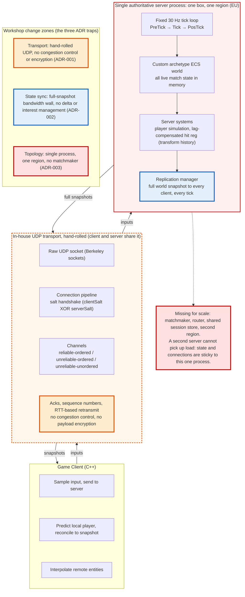

# Current Architecture (Breakline game server)

Detailed view of the current server, built on the real Network-Library shape. The three highlighted zones are the ADR traps the workshop's scaling work would change; everything else stays as is.

- 🟠 **orange** = the hand-rolled UDP transport: no congestion control, no payload encryption (ADR-001; Sam's fairness worry, Dana's maintenance burden)
- 🔵 **blue** = full-snapshot replication, the bandwidth wall: no delta, no interest management (ADR-002; Sam's game feel under load)
- 🔴 **red** = single process, one region, no matchmaker: the single point of failure and the reason you cannot just add servers (ADR-003; Dana's ops, Marco's launch and ping complaints)

